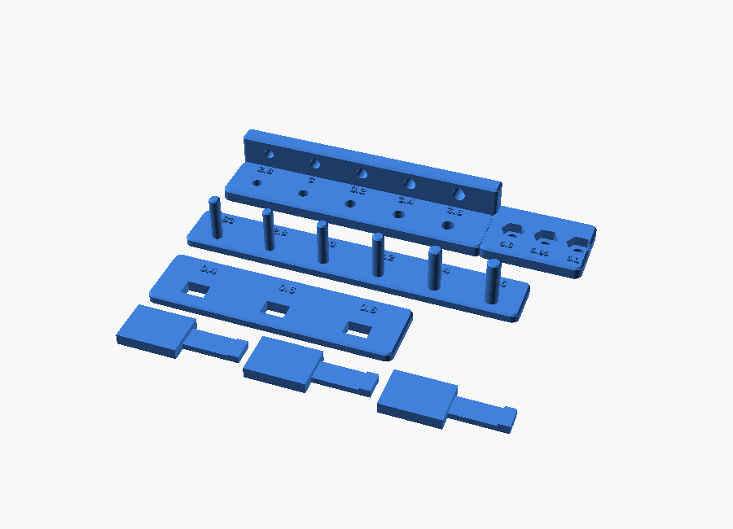

# 00 — Calibrate your printer: STEM_TOLERANCE_TEST

Print `STL/common/STEM_TOLERANCE_TEST.stl` (≈ 25 min, PLA, 20 % infill, no
supports). It contains six pieces:

| Piece | What it tests | Pass condition | If it fails |
|---|---|---|---|
| **Hole plate**, vertical holes 2.8 / 3.0 / 3.2 / 3.4 / 3.6 | shaft & screw clearance | a 3 mm steel rod slides freely through **3.4**, turns with light drag in **3.2** | shift `shaft_free_bore` / `grid_hole_d` by the difference |
| Same five as **horizontal teardrop holes** in the wall | horizontal bushings (axle / bearing mounts) | rod turns freely in 3.4 | as above; horizontal holes usually print ~0.1 mm smaller |
| **Nut pockets** 5.6 / 5.85 / 6.1 mm AF | captive nuts | M3 nut drops into **5.85** and does not spin | set `nut_pocket_af` to the smallest size that accepts a nut |
| **Pin comb**: S3 (= 3.0 mm kit shaft) + 2.8…3.6 pins | how your printer sizes small cylinders | S3 pin fits the 3.4 hole with a slight wobble | if pins are fat, raise `tolerance` |
| **Snap hooks** 0.4 / 0.6 / 0.8 mm interference + receiver | snap fits (panel detent, motor cradle feel) | 0.6 clicks in and holds; 0.8 needs firm pressure | PLA stiff → use PETG for the motor mount or increase `tolerance` |

Hub bores (3.15 mm, set-screw locked) are one step tighter than the 3.2 hole:
if a 3 mm rod will not enter the 3.2 test hole, raise `shaft_fixed_bore`.

After editing `PARAMETERS/config.scad`: `python3 tools/build.py && python3 tools/qc.py`.
