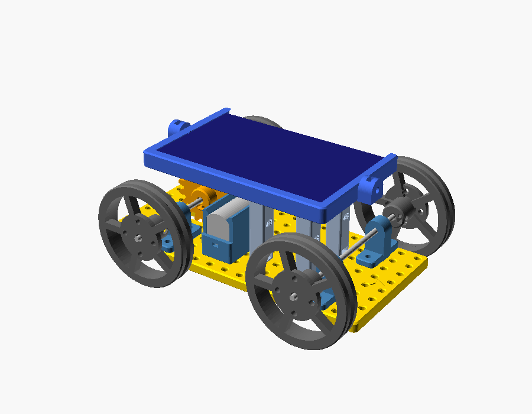
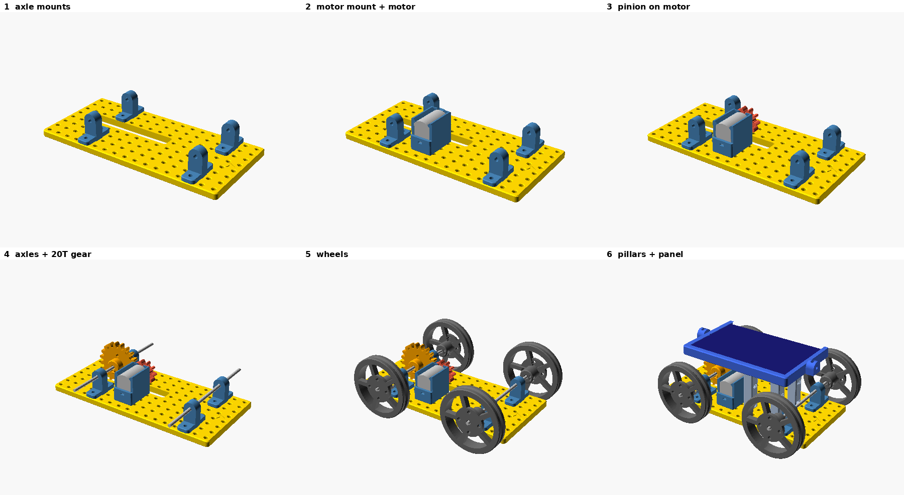
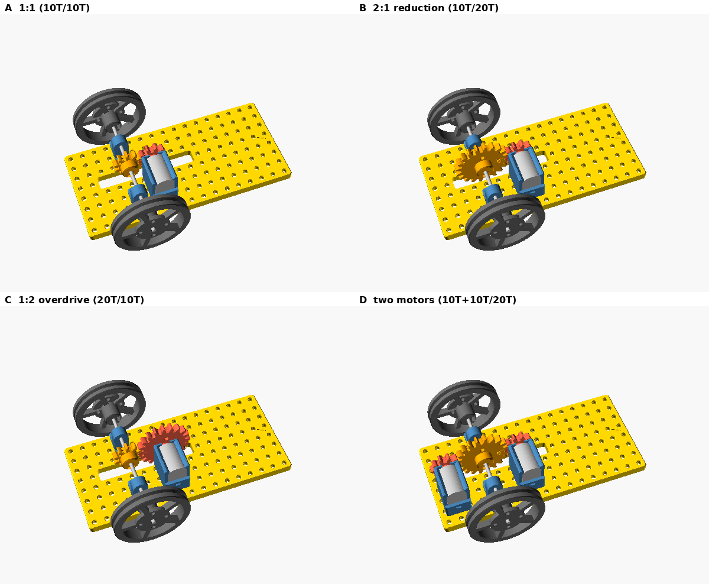

# 01 — Solar vehicle (Kit 4)

**Verified:** versions A, B, C, D and a rolling position of B pass the virtual
assembly check (no clashes; the motor-pinion press fit is the only designed
overlap; gear mesh swept through a full tooth pitch). See
[../QC_REPORT.md](../QC_REPORT.md).

## Parts
Chassis · 4 spoked wheels + 4 O-ring tyres (50 × 3) · 4 axle mounts · slotted
motor mount + 130 solar motor · 10T motor pinion · 20T gear · 2 × Ø3 × 120 mm
steel axles · 4 × 48 mm pillars · solar panel frame + 110 × 69 panel.
Hardware: 18 × M3 × 10, 10 × M3 nut, 5 × M3 × 6 grub + nut.

## Steps

1. **Axle mounts.** Four axle mounts on the chassis, feet along the chassis
   width: rear pair at x = 45 (holes y = 15/35 and 45/65), front pair at
   x = 145. Screws from the top, nuts in the pockets underneath.
2. **Motor.** Screw the slotted motor mount at x = 75, holes y = 5/25 (slots
   centred). Snap the motor in, boss toward the centre line. Press the 10T
   pinion onto the motor shaft, collar toward the motor, leaving ~0.5 mm gap.
3. **Axles and gear.** Slide the rear axle through both rear mounts, fitting
   the 20T gear (hub toward the motor side of the car) on the way. Line its
   teeth up with the pinion (look from above) and tighten its grub screw.
4. **Wheels.** Fit a wheel on each axle end, hub toward the chassis, 1 mm clear
   of the chassis edge; tighten the grub screws. Stretch the O-ring tyres into
   the grooves.
5. **Panel.** Screw four 48 mm pillars to the chassis at (65, 55), (125, 55),
   (95, 25), (125, 25) — screw up from under the chassis into each pillar's
   captive nut. Slide the panel into its frame from the open side until it
   clicks, then screw the frame onto the pillars (counterbored holes, x-offsets
   −25, 5, 35 from the frame centre).
6. **Wire** panel → (switch) → motor. If the car runs backwards, swap the wires.

## Versions (Experiment E01)

| Version | Motor at x | Motor gear | Axle gear |
|---|---|---|---|
| A 1:1 | 65 | 10T motor pinion | 10T |
| B 2:1 | 75 | 10T motor pinion | 20T |
| C 1:2 | 75 | 20T motor gear | 10T |
| D 2 motors | 75 and 15 | 10T pinion each | 20T |

The gear slot in the chassis lets the Ø44 20T gears pass below the deck
(ground clearance stays 8 mm).
