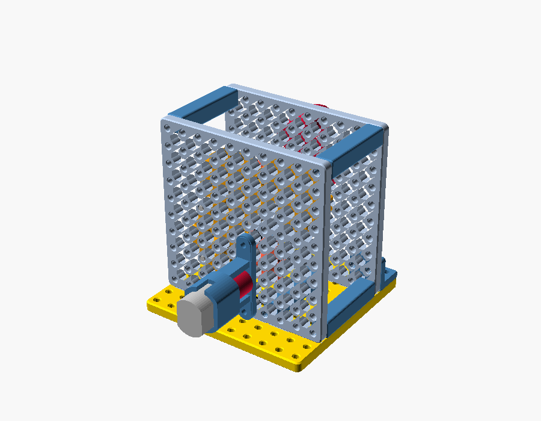
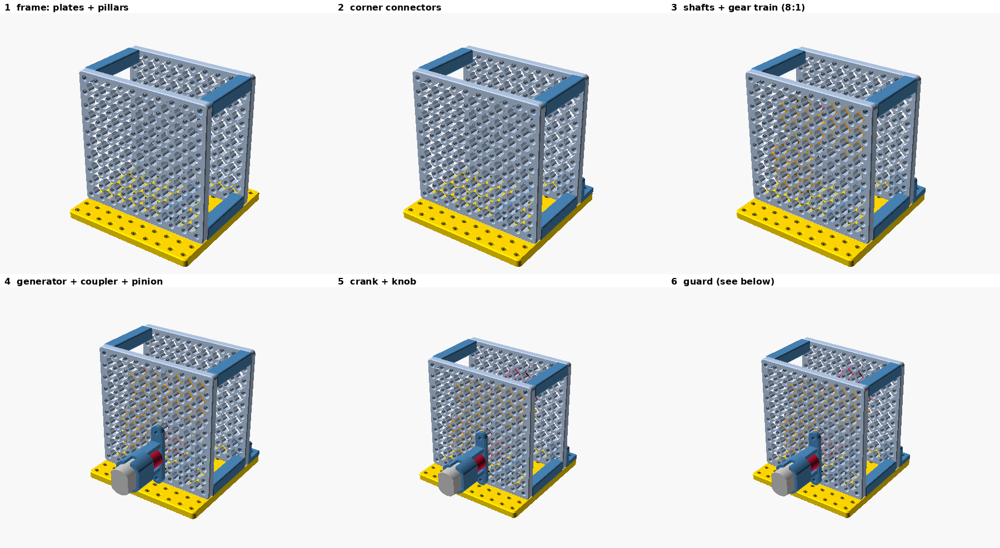
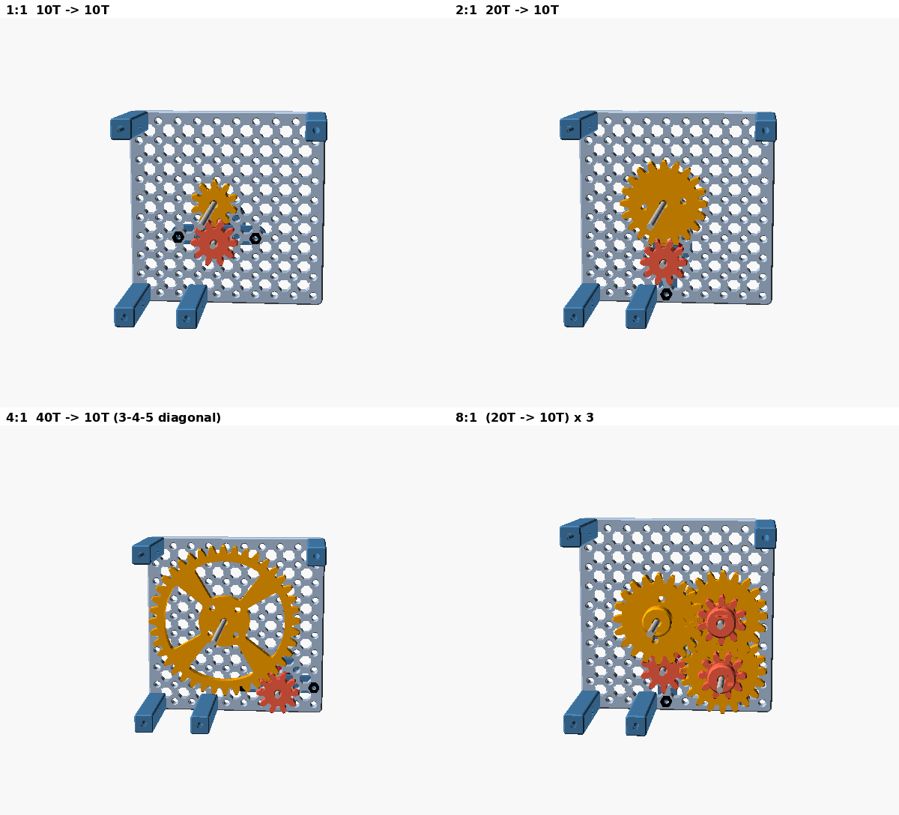
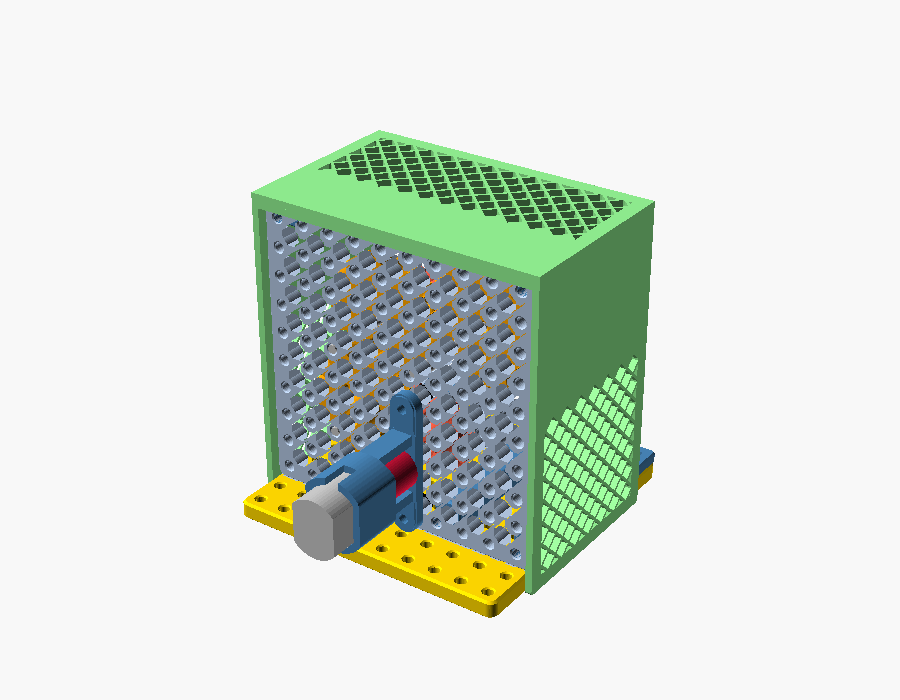

# 02 — Hand-crank dynamo (Kit 2) on the gearbox frame

**Verified:** ratios 1:1, 2:1, 4:1, 8:1 and five crank angles pass the virtual
assembly check (27 parts at 8:1, no clashes, every mesh swept). See
[../QC_REPORT.md](../QC_REPORT.md).

## Parts
Base plate · 2 gearbox frame plates · 4 × 48 mm pillars · 2 corner connectors ·
gears (10T ×4, 20T ×3, 40T ×1) · shafts Ø3 × 80 (crank), 2 × 60, 1 × 40 ·
hand crank + knob · generator mount + coupler + 12 V-rated 130 motor ·
guard · output panel (on a second plate).

## Coordinates
Frame plate holes are named (x, z): x along the plate from its left edge,
z up from the base plate. Plate A (crank side) outer face sits on the base
plate's 2nd grid line (20 mm from the edge), plate B outer face 60 mm further.

## Steps

1. **Frame.** Bolt four 48 mm pillars between the two frame plates at
   (5, 5), (35, 5), (5, 95), (95, 95) — M3 × 10 through each plate into the
   pillar's captive nuts. (No pillar at (95, 5): that corner is where the gear
   trains live.)
2. **Stand it up.** Two corner connectors on plate A's outer face at x = 5/15
   and 85/95, horizontal legs on the base plate.
3. **Crank shaft S0** (80 mm) through hole (45, 55) of both plates.
4. **Gears** — choose a ratio (table below). Hubs face the nearer plate; slide
   each gear to its level and tighten the grub screw.
5. **Generator.** Push the coupler onto the motor shaft, fit the motor into the
   generator mount, then slide the 40 mm pinion shaft into the coupler's 3 mm
   side and lock it. Put the shaft through plate B at the generator hole, fit
   the 10T pinion inside (level B), and bolt the mount's foot to plate B.
6. **Crank.** Crank hub on S0 outside plate A, 0.5 mm clear of the plate, both
   grub screws tight (file a small flat on the rod for them). Knob on its
   M3 × 40 at the 30 mm hole (or 20 mm).
7. **Guard on** — lower it over the frame until its lips sit on the plates.
8. Wire the generator to the output panel (LED, buzzer, capacitor, meter).

| Ratio | S0 gear (level) | Idler shafts | Generator hole | Generator foot holes |
|---|---|---|---|---|
| 1:1 | 10T (B) | — | (45, 35) | (25, 35), (65, 35) |
| 2:1 | 20T (B) | — | (45, 25) | (45, 5), (45, 45) |
| 4:1 | 40T (B) | — | (75, 15) | (55, 15), (95, 15) |
| 8:1 | 20T (A) | S1 (75,55): 10T A + 20T M · S2 (75,25): 10T M + 20T B | (45, 25) | (45, 5), (45, 45) |

Gear levels (distance from plate A's outer face): A = teeth 14–20 mm,
M = 27.5–33.5 mm, B = 38–44 mm.

