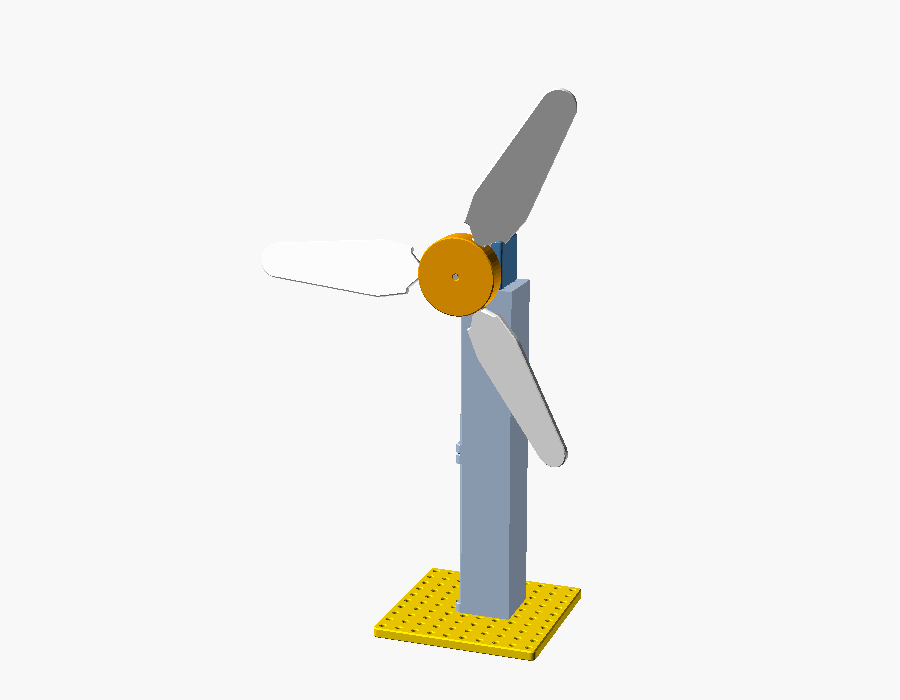

# 03 — Wind turbine (Kit 5)

**Verified:** 2-, 3- and 4-blade rotors with speed / standard / torque blades
at pitches −45°…45° and several rotor angles pass the virtual assembly check
(blades clear the tower by > 25 mm). See [../QC_REPORT.md](../QC_REPORT.md).

## Parts
Base plate · 2 tower segments · common motor mount · 12 V-rated 130 motor
(generator) · motor coupler · Ø3 × 40 shaft · hub (2/3/4) · blades.

## Steps
1. **Tower.** Bolt segment 1 to the base plate centred on hole (45, 45): M3 × 12
   down through the bottom flange (reach in through the open side). Stack
   segment 2 on top with M3 × 12 into the nut pockets under segment 1's top
   flange.
2. **Generator.** Motor mount on the top flange (holes (0, ±10), M3 × 10, nuts
   under the flange). Snap the motor in.
3. **Drive.** Coupler onto the motor shaft; 40 mm shaft into the coupler; hub
   on the shaft end, hub toward the motor, grub screw tight.
4. **Blades.** Push each blade root into a socket, twist it to the chosen pitch
   (fin against the tick marks; 0° = flat), lock with an M3 × 8 from the top.
5. **Safety:** fan on low, at least 1 m away; nobody within arm's reach of the
   rotor; weight or clamp the base plate; stop the rotor by switching the fan
   off.
