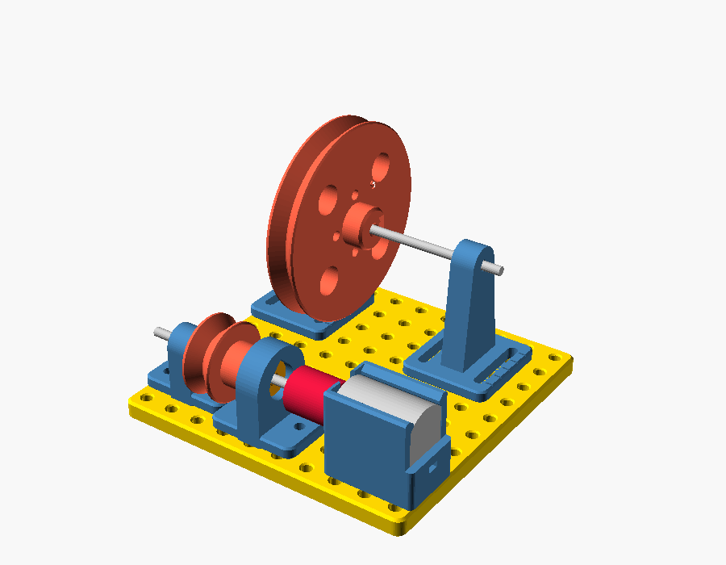

# 04 — Pulley & belt lab (Kit 8)

**Verified:** no clashes; driver Ø20 pulley at 17 mm axis, driven Ø60 at 37 mm
(the "high" standard axis), 3:1. See [../QC_REPORT.md](../QC_REPORT.md).

## Steps
1. Motor mount at (15, 15) (holes y 5/25); motor in; coupler on its shaft.
2. Bearing mount at (15, 55) with the printed bushing insert (or a 623 in its
   adapter); axle mount at (15, 85). 60 mm shaft from the coupler through both.
3. Ø20 pulley on the shaft, hub toward the bearing mount, groove 73 mm from the
   plate's front edge.
4. Two belt-pulley mounts at x = 75 (holes y 15/35 and 75/95), 80 mm shaft,
   Ø60 pulley in line with the Ø20 (check by sighting along the belt).
5. O-ring belt (2.5 mm cord, ID ≈ 76 mm). Slide both belt mounts outward along
   their slots until the belt is just taut; tighten.
6. Swap pulleys (Ø40/Ø40, Ø60/Ø20), cross the belt — Experiment E04.
