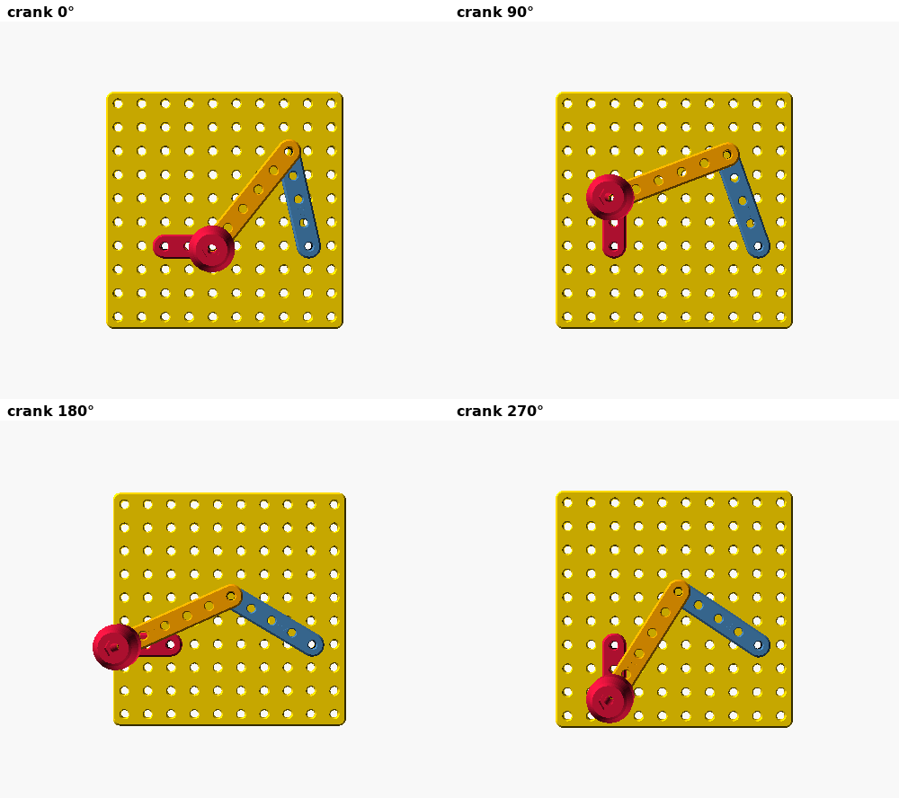

# 05 — Four-bar linkage (Kit 10)

**Verified:** 360° kinematic sweep (Grashof crank-rocker, transmission angle
51°–125°, 20 mm clearance crank↔rocker, stays on the plate) and four 3-D
positions with no clashes. See [../QC_REPORT.md](../QC_REPORT.md).

## Parts
Base plate · link bars 3-hole (crank, 20 mm), 6-hole (coupler, 50 mm), 5-hole
(rocker, 40 mm) · crank knob · M3 × 12 ×2, M3 × 16, M3 × 40, 4 nuts, 2 nylocks.

## Steps
1. **Ground pivots** at plate holes A (25, 35) and B (85, 35). Drop an M3 nut
   into the pocket under each hole and lay a second nut on the plate over the
   hole. Put the **crank** (3-hole link) over A and the **rocker** (5-hole)
   over B, then drive an M3 × 12 down through link → top nut → plate → pocket
   nut until its head just touches the link. Back off ¼ turn and spin the top
   nut down hard onto the plate: the screw is now locked and the link turns
   freely under its head.
2. Crank and rocker are on the same layer; the check shows 20 mm clearance
   between them over the whole cycle.
3. **Coupler** (6-hole) on top: end hole to the crank's far hole (M3 × 40
   up from under the crank, nut on the crank, coupler, then the knob and its
   nylock), other end to the rocker's far hole (M3 × 16, nut on the rocker,
   coupler, nylock). Snug, then back off ¼ turn.
4. Turn the knob. Then Experiment E05.
