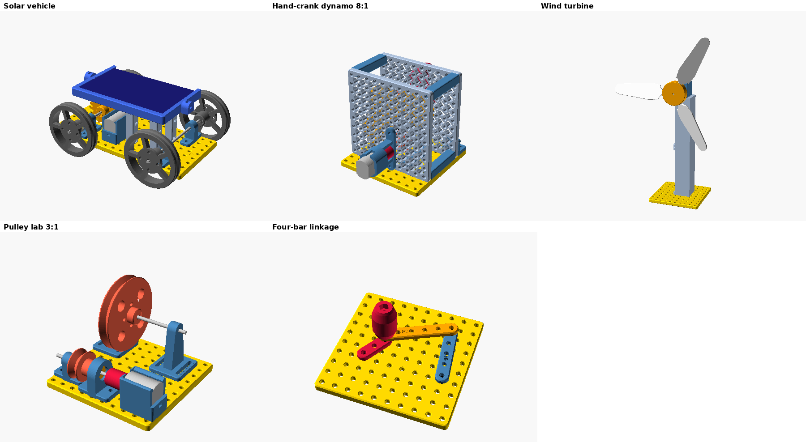

# STEM_KIT — a modular, 3D-printable STEM construction system

A parametric (OpenSCAD) library of mechanical parts that children aged ~7–14
use to **build, test, break, modify and understand** real machines: solar cars,
hand-crank generators, wind turbines, gear trains, belt drives and linkages.
It is an *ecosystem*, not a pile of STLs: every part obeys one mechanical
standard (the **ForgeGrid**), so the same base plate, gears, shafts, motor
mount and screws are reused across every kit.



## The standard in one paragraph

Holes on a **10 mm grid** (Ø3.4, 5 mm from every edge) · **M3 button-head
screws only** (4 mm foot + 6 mm plate = M3 × 10, nut captive in the plate) ·
**Ø3 mm steel shafts** · every horizontal shaft **17 mm** above its mounting
surface · **module-2 gears with 10/20/30/40 teeth**, so the centre distance
(z1 + z2) mm is always a multiple of 10 and *any gear meshes any gear on the
grid* · one Ø14 set-screw hub on every rotating part. Full spec:
[DOCUMENTATION/STANDARD.md](DOCUMENTATION/STANDARD.md).

## Phase 1 (MVP) — what is here

| Area | Parts (STL) | Verified build |
|---|---|---|
| Common | base plate, rails, corner connector, thumb nut, motor coupler, pillars, printed shafts, shaft collar, bearing mount + 623/bushing inserts, axle mount, motor mount, gears 10/20/30/40T (+ idler, motor-bore), wheel, solar panel frame, tilt bracket, **STEM_TOLERANCE_TEST** | — |
| Solar | vehicle chassis, spoked wheel, slotted motor mount | Solar car versions A/B/C/D |
| Dynamo | hand crank, free-spinning knob, generator mount, gear guard, output panel | Hand-crank generator 1:1 / 2:1 / 4:1 / 8:1 |
| Mechanical | gearbox frame plate (lattice), pulleys Ø20/40/60, belt-pulley mount, link bars | Pulley lab, four-bar linkage |
| Wind | hubs (2/3/4 blades, adjustable pitch), blades (standard / torque / speed), tower segment | Wind turbine |

**52 STLs**, all generated from source, each with name, size, orientation,
infill, support and material data in [DOCUMENTATION/PARTS.md](DOCUMENTATION/PARTS.md).

## What "verified" means here

`tools/` contains the checks that ran on every part and assembly
([DOCUMENTATION/QC_REPORT.md](DOCUMENTATION/QC_REPORT.md)):

* **Every STL**: watertight, consistently wound, accepted by manifold3d (no
  self-intersections), single body, on the bed in print orientation, fits a
  200 mm printer; wall thickness and overhang/bridge areas measured.
* **Every assembly configuration** (23 of them): each part is rendered in
  world coordinates and every pair is intersected with exact mesh booleans —
  shafts in bores, motors in cradles, gears in frames, blades past the tower,
  crank at 5 angles, linkage at 4 angles.
* **Every gear mesh** (25 checks): sliced and rotated through a full tooth
  pitch at the true ratio — zero overlap, constant 0.13–0.14 mm flank gap, and
  it locks if the backlash is removed.
* **Linkage**: 360° kinematic sweep (Grashof, transmission angle 51°–125°).

During development these checks caught — and forced fixes for — real design
errors: a generator motor whose flats fought its socket when the mount was
rotated, a solar-panel detent ridge sitting *under* the seated panel, a wide
turbine blade whose root intruded into the hub, a guard lip that would print as
a 100 mm unsupported overhang, and a four-bar geometry with a poor 22°
transmission angle (ground link changed 40 → 60 mm, now 51°–125°).

Not verified (and not claimed): real-printer tolerances, friction, stiffness,
electrical output. The parts have **not yet been physically printed**; the
tolerance test and the experiments exist to close that gap.

## Quick start

```bash
# requirements: OpenSCAD 2021.01+, Python 3.10+, pip install trimesh manifold3d shapely numpy networkx rtree pillow
python3 tools/build.py        # render all STLs into STL/
python3 tools/qc.py           # part QC  -> DOCUMENTATION/PARTS.md
python3 tools/verify_all.py   # assembly + gear + linkage checks -> DOCUMENTATION/QC_REPORT.md
python3 tools/render_docs.py  # assembly diagrams -> DOCUMENTATION/assembly/img/
```

Change any value in [PARAMETERS/config.scad](PARAMETERS/config.scad) (shaft
size, tolerance, gear module, motor size, panel size…) and re-run: the whole
library regenerates and re-verifies.

## Documentation

| | |
|---|---|
| [STANDARD.md](DOCUMENTATION/STANDARD.md) | the ForgeGrid mechanical standard |
| [PARTS.md](DOCUMENTATION/PARTS.md) | every part: STL, source, size, orientation, infill, supports, material |
| [BOM.md](DOCUMENTATION/BOM.md) | printed parts per build + all non-printed components |
| [PRINTING.md](DOCUMENTATION/PRINTING.md) | slicer settings, orientation, post-processing |
| [assembly/](DOCUMENTATION/assembly/) | build guides with diagrams (tolerance test, solar car, dynamo, wind, pulleys, linkage) |
| [experiments/](DOCUMENTATION/experiments/) | 7 experiment sheets (question → prediction → build → experiment → measure → explain → challenge) |
| [lessons/](DOCUMENTATION/lessons/) | Explorer (7–9), Engineer (9–12), Inventor (12–14) lesson plans |
| [QC_REPORT.md](DOCUMENTATION/QC_REPORT.md) | verification results |
| [ROADMAP.md](DOCUMENTATION/ROADMAP.md) | next 20 components, known limitations, improvements |
| [SAFETY.md](DOCUMENTATION/SAFETY.md) | designed-in safety + classroom rules |

## Folder structure

```
STEM_KIT/
├── PARAMETERS/config.scad      one file drives everything
├── COMMON/                     shared system: stem_core.scad (helpers),
│   ├── shafts/ bearings/ gears/ connectors/ fasteners/ mounts/ wheels/
├── SOLAR/vehicle/  (satellite/: phase 2)
├── DYNAMO/hand_generator/  (vehicle/: phase 2)
├── WIND/turbine/   WATER/turbine/ (phase 2)
├── MECHANICAL/gearbox/ pulley/ linkage/  (planetary/: phase 2)
├── ROBOTICS/robot_arm/ (phase 2)
├── ASSEMBLIES/                 verified virtual assemblies (+ bought-part models)
├── STL/common|solar|dynamo|wind|mechanical/   generated STLs
├── tools/                      build, QC, assembly verification, renders
└── DOCUMENTATION/
```

## Design philosophy

**BUILD → TEST → FAIL → MODIFY → TEST AGAIN → UNDERSTAND.** Parts are designed
so a child can build something *wrong* and see why: gears one grid hole too
far apart skip, the slotted motor mount can be pushed too close and stalls, a
3 V motor used as a generator won't light the LED, a blade at 0° pitch won't
turn, a linkage with the wrong link lengths locks. Every experiment sheet has a
"build it wrong on purpose" section.

Priorities: modularity > printability > durability > educational value > appearance.
