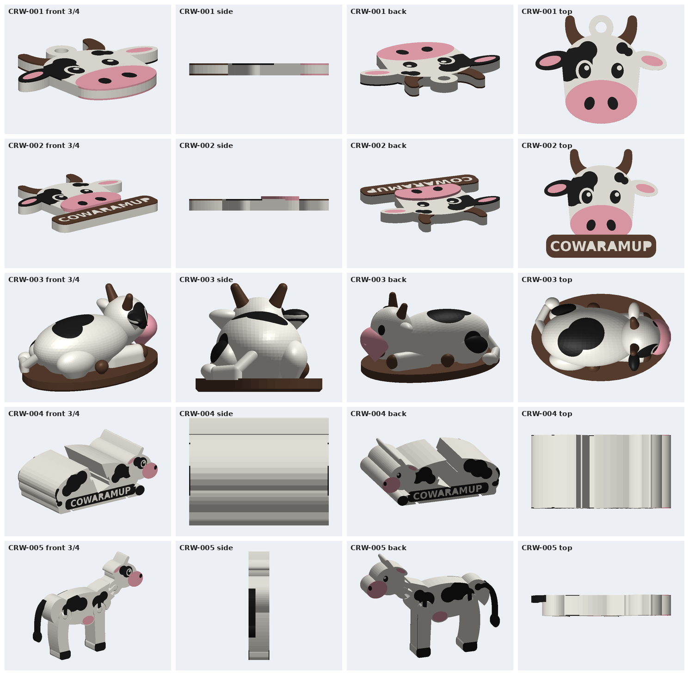

# DESIGN AUDIT - Phase 1 prototypes (before redesign)

Reviewed: all five phase-1 products, via the STL/3MF files and CAD source (archived in `stl/archive/before-redesign/`,
`3mf/archive/before-redesign/`, `cad/archive/before-redesign/`). The views below are rendered from the same geometry:

## Overall verdict

The phase-1 set is **technically sound but commercially weak**. It proves the manufacturing system works: tool
assignment, purge control, QC. But four of the five products are **2D drawings extruded into slabs**. They read
well from exactly one angle, and are featureless strips from the side, back, top or bottom. The one true 3D
figure (CRW-003) is a set of ellipsoids with no expression, and its support-free "keels" read as artefacts
(the beak-like chin, the wedge ears).

Nothing here would make a tourist pick it up and turn it over. Common failures:

| Failure | Where | Why it reads as "cheap 3D print" |
|---|---|---|
| Flat extrusion, vertical walls, sharp 90-degree edges | 001, 002, 004, 005 | the tell-tale look of a 2D-to-STL conversion |
| Side/back/top views are blank slabs | 001, 002, 004, 005 | nothing to discover when the product is handled |
| Face is a flat sticker | all | no eye sockets, lids, muzzle volume or smile, so no personality |
| Symmetric, static poses | all | reads as a CAD placeholder, not a character |
| Patches are flat blobs | all | not following form, no tactile relief |
| Branding on a flat rectangle | 002, 004 | "label stuck on", not part of the object |
| Primitive horns/legs (capsules, cylinders) | 003, 005 | low-poly toy look |
| No hidden details / numbering | all | nothing collectible to discover |
| No base story | 003 (plain oval), others none | no sense of place (Cowaramup, paddock, WA) |

What **does** work and must be kept:
- The mascot's front-face graphic: oversized pink muzzle, patch over one eye, leaf ears. It is recognisable and cute.
- Colour discipline: large regions, a clear purpose for every tool.
- The manufacturing tricks: sandwich inlays, knocked-out text, slide-in TPU, bicone print-in-place joints,
  support-free design.

---

## CRW-001 Keyring (flat face)

| Question | Finding |
|---|---|
| Basic | It is a flat 4.2 mm cookie-cutter face. The side view is a strip. |
| Generic | "Cow emoji on a keyring" - found on every marketplace. |
| Cowaramup identity | None on the object at all. |
| Looks cheap because | vertical walls, sharp edges, the separate ring tab, no depth |
| More collectible | a numbered ear tag, and a miniature 3D cow instead of a face |
| More premium | rounded forms, sculpted face, tactile raised patches |
| 4-toolhead use | good (4 colours), but only as flat stickers |
| Printable details to add | sculpted eyes/lids, muzzle volume, smile groove, ear tag with number |
| Proportions | fine for a face, wrong product: the brief asks for a 3D cow at 45-60 mm |
| Silhouette | the loop tab reads as an add-on. Integrate the loop into the body (tail loop). |
| Textures | tail tuft grooves, raised patches |
| Functional | durable loop through a thick part of the model, no thin horns |
| Packaging/display | peg card; looks the same as a 99-cent keyring |

**Decision:** replace with a **3D sitting mini-cow keyring** whose tail curls into the key loop.

## CRW-002 Head magnet (flat face + banner)

| Question | Finding |
|---|---|
| Basic | a flat face plus a flat rectangular banner; only the muzzle is raised |
| Generic | a sign-shop fridge magnet |
| Cowaramup identity | the text only, on a plain rectangle |
| Looks cheap because | slab edges, rectangle banner, no depth in eyes/ears |
| More collectible | numbered ear tag, series look shared with the figures |
| More premium | a real relief sculpture: domed head, ears and horns in depth, scroll ribbon |
| 4-toolhead use | good, but the banner is the only T4 use |
| Printable details | eyelids, pupils and highlights, nostril recesses, smile, ear tag |
| Proportions | good; keep the face-dominant layout |
| Silhouette | the rectangle banner kills it. Replace with a curved ribbon hugging the chin. |
| Textures | forelock tuft, ribbon folds |
| Functional | keep the rear magnet pockets |
| Packaging/display | card; it is fine but plain |

**Decision:** **dimensional head bust** (half-round relief, 60-70 mm) with a curved COWARAMUP ribbon and raised lettering.

## CRW-003 Mini collectible (ellipsoid cow)

| Question | Finding |
|---|---|
| Basic | primitive ellipsoids with visible joins; the legs are pill capsules |
| Generic | a "low-poly placeholder cow" |
| Cowaramup identity | underside text only |
| Looks cheap because | 45-degree keels (the beak chin, the wedge ears), primitive horns, no face sculpt |
| More collectible | series number, story base, a pose with attitude |
| More premium | blended (filleted) forms, sculpted face, collar + ear tag, paddock base |
| 4-toolhead use | yes, but the plinth colour and the horns share T4 without a story |
| Printable details | eyelids, smile, nostrils, hoof splits, tail tuft |
| Proportions | the body is too big and the head too small for "cute". A designer toy wants a big head (~40 % of height). |
| Silhouette | a lying pose reads as a blob from most angles. Use a sitting pose with the head up and turned. |
| Textures | grass on the base, raised patches, tuft grooves |
| Functional | none needed |
| Packaging/display | collector box with a numbered series strip |

**Decision:** full character re-sculpt (**the mascot**): sitting "Cowa" with a head tilt, collar and ear tag, on a
paddock base. Standard version (no base, 3 colours) and Deluxe version (base, 4 colours).

## CRW-004 Phone stand (extruded profile)

| Question | Finding |
|---|---|
| Basic | a 64 mm extrusion of a side drawing; the top view is a plain rectangle |
| Generic | a desk wedge with a sticker |
| Cowaramup identity | a flat band of text |
| Looks cheap because | it is obviously extruded; the ears/horns are slab fins |
| More premium | a real sculpted cow lying down whose back cradles the phone |
| 4-toolhead use | good (TPU pads), keep it |
| Printable details | face as on the mascot, raised patches, branded base |
| Proportions | reasonable size, wrong shape |
| Silhouette | must look good with no phone in it |
| Functional | slot, TPU contact and TPU feet are right, just not the form |
| Packaging/display | box; decent desk-gift potential |

**Decision:** redesign as a **sculpted resting cow** with an integrated slot, TPU saddle liner, TPU feet and a branded base.

## CRW-005 Articulated cow (flexi slabs)

| Question | Finding |
|---|---|
| Basic | 18 mm slabs with square edges; the front and top views are a stick |
| Generic | "flexi" style toy |
| Cowaramup identity | none |
| Looks cheap because | square edges, flat faces, open joint holes visible as plumbing |
| More premium | pillow-rounded members, sculpted face relief, ear tag |
| 4-toolhead use | good (skins + TPU tail) |
| Printable details | domed eye, muzzle volume, hoof split, tail texture |
| Proportions | the head is too small; the legs are one slab per pair |
| Silhouette | good side silhouette; needs volume |
| Functional | joints are the value; keep the geometry that validated |
| Packaging/display | window box posed walking |

**Decision:** keep the proven joint system; **re-form every member as a rounded, sculpted volume** with face relief, a larger head and an ear tag.

## Priority for this session

1. Mascot (new 3D character) -> 2. Mini collectible -> 3. Keyring -> 4. Magnet -> 5. Articulated cow -> 6. Phone stand.
Themed scene cows (Surfer, Wine, Farmer, Aussie, Christmas) wait until the mascot is right.
