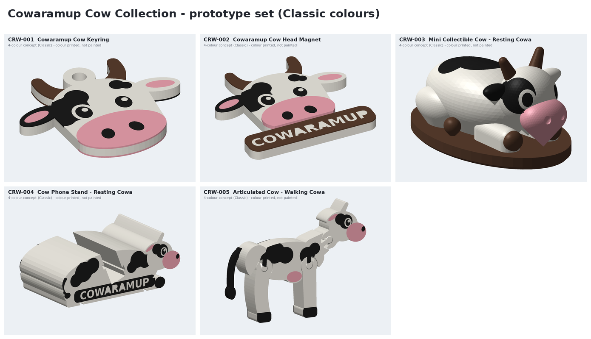

# "Cowa" - the Cowaramup cow mascot

Original character designed for 4-tool FFF from the first sketch. Source: `cad/cows/face.py` (front),
`cad/cows/side.py` (side profile), `cad/cows/solid.py` (3D figure).

## Design language

| Element | Rule | Tool role | Why |
|---|---|---|---|
| Head | broad rounded forehead flowing into the muzzle (convex hull) | tool 1 | strong silhouette, no thin necks |
| Muzzle | **oversized** - ~45 % of face height, pink | tool 3 | the cuteness cue; readable at 3 m |
| Nostrils | two big ovals (flat items) / dimples (3D mini) | tool 2 / geometry | no micro islands on 3D |
| Eyes | large ovals + one highlight >= 3.4 mm^2 | tool 2 + tool 1 | friendly, not childish |
| Signature patch | asymmetric patch over the cow's RIGHT eye, taking the whole ear on that side; white ring keeps the eye readable | tool 2 | instantly recognisable "Cowa" mark |
| Forehead spot | one small spot on the other side | tool 2 | balance |
| Ears | sideways leaf shape, pink inner ear | tool 1 + tool 3 | silhouette width |
| Horns | short, thick, up-curled | tool 4 accent | tool 4 has a purpose on every product |
| No outlines | colour blocks only, strokes >= 0.8 mm | - | outlines = thin lines = failures and tool changes |

Australian character comes from the colour families (green & gold, ocean, wine, earth) and the product themes, not
from copied artwork.

## The eight themes

Implemented as colour variants in `config/variants.json` (geometry unchanged; accessory geometry is a
post-gate task listed in `products/concepts.json`).

| Theme | T1 | T2 | T3 | T4 | Accessory geometry (planned) |
|---|---|---|---|---|---|
| Classic | Cow White | Cow Black | Cow Pink | Earth Brown | - |
| Aussie | Cow White | Cow Black | Australian Gold | Australian Green | scarf (CRW-B03) |
| Farmer | Cow White | Cow Brown | Cow Pink | Australian Gold | straw hat (CRW-B02) |
| Surfer | Cow White | Cow Black | Cow Pink | Ocean Blue | surfboard plinth (CRW-B04) |
| Wine Country | Cow Cream | Cow Black | Cow Pink | Margaret River Red | bottle + vine (CRW-B06) |
| Christmas | Cow White | Cow Black | Christmas Red ("Rudolph" muzzle) | Australian Green | Santa hat (CRW-B08) |
| Camping | Cow Cream | Cow Black | Cow Pink | Vine Green | lantern / tent plinth (CRW-B10) |
| Beach | Cow White | Cow Black | Cow Pink | Beach Sand | towel / board (CRW-B05) |
| (Jersey Brown) | Cow Cream | Cow Brown | Cow Pink | Earth Brown | - |

See `previews/CRW-001-cowaramup-keyring-classic/variants.png` for all keyring variants.
