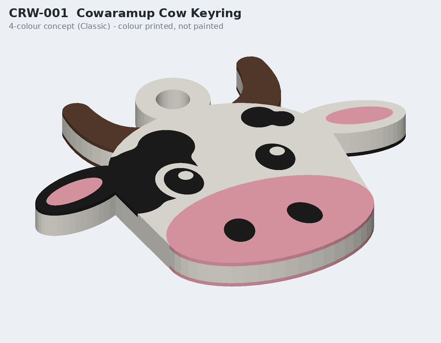
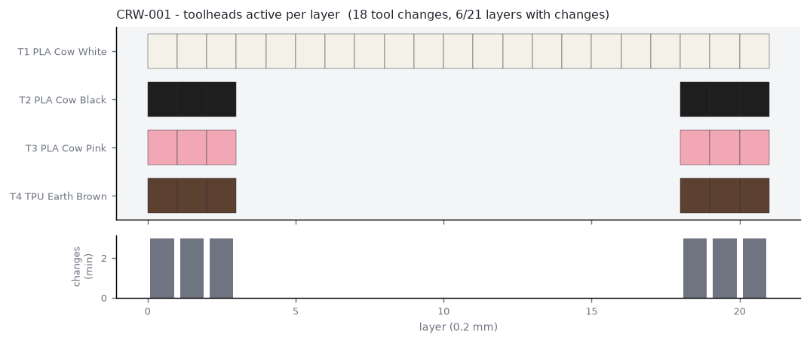

# CRW-001 - Cowaramup Cow Keyring

*A - Multi-colour impulse - STANDARD - tier IMPULSE*

Flat 4-colour mascot keyring, identical face on both sides, flush sandwich inlays, reinforced 5 mm keyring hole. No painting, no assembly beyond fitting the split ring.

## Manufacturing

- **Strategy:** A - one multi-colour model (sandwich inlay)
- **Print orientation:** Flat, either face on the bed (design is mirrored so both faces match).
- **Plate footprint:** 59.14 x 48.85 x 4.2 mm
- **Supports:** none (all overhangs <= 45 deg, bridges short)
- **Hardware:** split_ring_25mm, keyring_chain_link
- **Recommended batch:** 12 per plate

## Toolhead utilisation (per unit, estimate)

| Tool | Material / colour | Used for | Grams |
|---|---|---|---|
| tool_1 | PLA Cow White | core body, keyring loop, eye highlights | 4.95 |
| tool_2 | PLA Cow Black | signature patch, forehead spot, eyes, nostrils | 0.50 |
| tool_3 | PLA Cow Pink | muzzle, inner ears | 0.77 |
| tool_4 | TPU Earth Brown | horns | 0.18 |

- Purge (single unit): **1.08 g** from **18** tool changes on 6/21 layers
- Total material (single unit incl. purge): **7.48 g**
- Estimated print time (single unit): **23.0 min** (extrusion 14.9, tool changes 2.4, layers 0.5, heat-up 5.0)

## Economics (NORMAL scenario, recommended batch) - estimate only

- Unit cost **$1.41**; suggested retail **$5-10** (price band / cost floor - not a demand forecast)

## Self-critique

- **exploits 4 tools:** Yes - four colours in one print with zero painting; a single-colour printer would need hand painting of 7 regions per side.
- **every colour has purpose:** White = body/structure, black = cow identity (patches/eyes), pink = muzzle (cuteness/readability), tool 4 = horns (silhouette cue).
- **tool change reduction:** Colour confined to 6 of 21 layers; middle layers single-tool.
- **suitcase durability:** Flat, no thin cantilevers except horn tips (>= 4 mm wide).
- **batch:** Flat and small -> 16-32 per plate; per-unit purge falls with batch size.

## Notes / known risks

- Horn tips are the most exposed feature; if drop tests chip them, switch tool_4 to TPU (no geometry change needed).

## Toolhead set-up issues

- [WARN] colour Earth Brown is not commonly available in TPU

## Files

- `3mf/prototypes/CRW-001-cowaramup-keyring-classic.3mf`
- `3mf/prototypes/variants/CRW-001-cowaramup-keyring-classic--aussie.3mf`
- `3mf/prototypes/variants/CRW-001-cowaramup-keyring-classic--surf.3mf`
- `3mf/prototypes/variants/CRW-001-cowaramup-keyring-classic--wine.3mf`
- `3mf/prototypes/variants/CRW-001-cowaramup-keyring-classic--christmas.3mf`
- `3mf/prototypes/variants/CRW-001-cowaramup-keyring-classic--jersey.3mf`
- `3mf/prototypes/variants/CRW-001-cowaramup-keyring-classic--farmer.3mf`
- `3mf/prototypes/variants/CRW-001-cowaramup-keyring-classic--camping.3mf`
- `3mf/prototypes/variants/CRW-001-cowaramup-keyring-classic--beach.3mf`
- `stl/prototypes/CRW-001-cowaramup-keyring-classic.stl`
- `stl/prototypes/CRW-001-cowaramup-keyring-classic/CRW-001-cowaramup-keyring-classic.scad`
- STEP: not generated (see documentation/assumptions.md)

Previews: `previews/CRW-001-cowaramup-keyring-classic/` (single-colour, four-colour, multi-material, dimensions, print orientation, variants)
