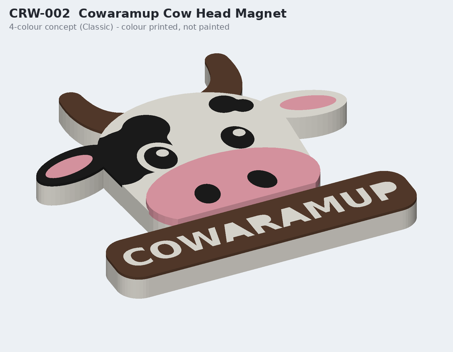
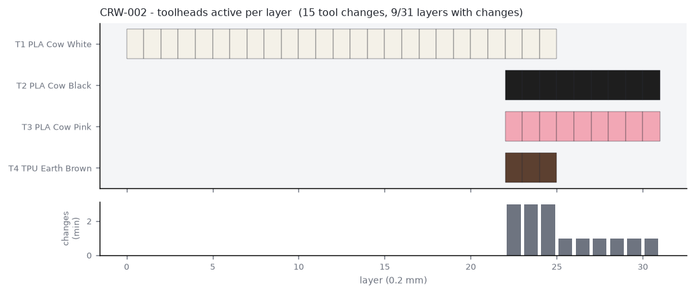

# CRW-002 - Cowaramup Cow Head Magnet

*A - Multi-colour impulse - STANDARD - tier IMPULSE*

4-colour fridge magnet: mascot head with raised pink muzzle and a COWARAMUP banner whose lettering is knocked out to the white core. Two press-fit 12x3 mm magnets.

## Manufacturing

- **Strategy:** E - hybrid printed + hardware (magnets)
- **Print orientation:** Face up, magnet pockets on the bed face.
- **Plate footprint:** 64.21 x 61.22 x 6.2 mm
- **Supports:** none (all overhangs <= 45 deg, bridges short)
- **Hardware:** neodymium_disc_12x3, neodymium_disc_12x3
- **Recommended batch:** 9 per plate

## Toolhead utilisation (per unit, estimate)

| Tool | Material / colour | Used for | Grams |
|---|---|---|---|
| tool_1 | PLA Cow White | core body, knocked-out banner lettering, eye highlights | 8.42 |
| tool_2 | PLA Cow Black | patches, eyes, nostril plugs | 0.37 |
| tool_3 | PLA Cow Pink | raised muzzle, inner ears | 1.04 |
| tool_4 | TPU Earth Brown | horns, banner | 0.55 |

- Purge (single unit): **0.9 g** from **15** tool changes on 9/31 layers
- Total material (single unit incl. purge): **11.28 g**
- Estimated print time (single unit): **33.0 min** (extrusion 25.1, tool changes 2.0, layers 0.8, heat-up 5.0)

## Economics (NORMAL scenario, recommended batch) - estimate only

- Unit cost **$2.00**; suggested retail **$6-10** (price band / cost floor - not a demand forecast)

## Self-critique

- **exploits 4 tools:** Yes - four colours plus 3D relief and knocked-out text in one print.
- **every colour has purpose:** Tool 4 doubles as horns AND banner so the brand line costs no extra tool.
- **tool change reduction:** Colour only in the top 9 layers; bottom 22 layers single-tool.
- **single colour alternative:** A single-colour print would need the banner text embossed and the face hand-painted - far less legible at market distance.

## Notes / known risks

- Magnets are pressed in after printing (no mid-print pause needed).
- Pocket fit (0.15 mm radial clearance) must be confirmed on the real printer; adjust magnet_fit_clearance in config/dimensions.json.

## Toolhead set-up issues

- [WARN] CRW-002 prefers rigid (PLA) in tool_4; TPU loaded - printable, but: banner should be rigid; TPU works but reads less crisp
- [WARN] colour Earth Brown is not commonly available in TPU

## Files

- `3mf/prototypes/CRW-002-cowaramup-magnet.3mf`
- `3mf/prototypes/variants/CRW-002-cowaramup-magnet--aussie.3mf`
- `stl/prototypes/CRW-002-cowaramup-magnet.stl`
- `stl/prototypes/CRW-002-cowaramup-magnet/CRW-002-cowaramup-magnet.scad`
- STEP: not generated (see documentation/assumptions.md)

Previews: `previews/CRW-002-cowaramup-magnet/` (single-colour, four-colour, multi-material, dimensions, print orientation, variants)
