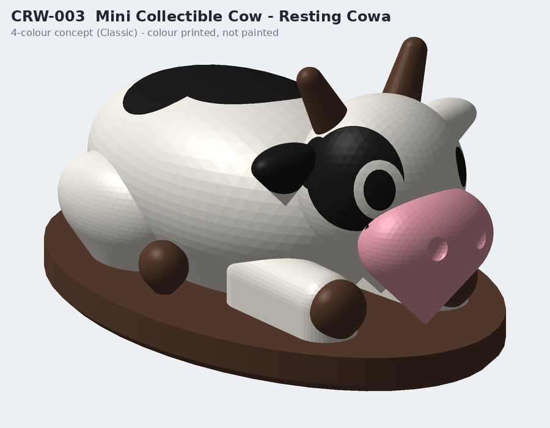
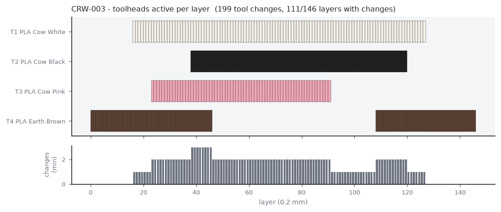

# CRW-003 - Mini Collectible Cow - Resting Cowa

*A - Multi-colour impulse - STANDARD - tier SMALL_GIFT*

50 mm resting mascot cow on an oval plinth. Four colours as true 3D volumes, support-free, underside debossed COWARAMUP WA.

## Manufacturing

- **Strategy:** A - one multi-colour model (3D colour volumes, vertical zoning)
- **Print orientation:** Upright on the plinth (as displayed). No supports.
- **Plate footprint:** 54.4 x 34.0 x 29.15 mm
- **Supports:** none (all overhangs <= 45 deg, bridges short)
- **Hardware:** none
- **Recommended batch:** 24 per plate

## Toolhead utilisation (per unit, estimate)

| Tool | Material / colour | Used for | Grams |
|---|---|---|---|
| tool_1 | PLA Cow White | body, head, legs, ears, tail + tuft, eye ring | 5.75 |
| tool_2 | PLA Cow Black | saddle/hip/head patches, eyes | 1.03 |
| tool_3 | PLA Cow Pink | muzzle | 0.58 |
| tool_4 | PLA Earth Brown | plinth, hooves, horns | 4.73 |

- Purge (single unit): **11.94 g** from **199** tool changes on 111/146 layers
- Total material (single unit incl. purge): **24.03 g**
- Estimated print time (single unit): **63.3 min** (extrusion 27.1, tool changes 26.5, layers 3.6, heat-up 5.0)

## Economics (NORMAL scenario, recommended batch) - estimate only

- Unit cost **$1.66**; suggested retail **$10-20** (price band / cost floor - not a demand forecast)

## Self-critique

- **exploits 4 tools:** Yes - a painted-look figurine with no painting. Single-colour would need hand-painting ~10 regions.
- **tool change reduction:** Nostrils as dimples, no eye highlights, saddle patch on the top layers only; plinth layers are near single-tool.
- **suitcase durability:** Lying pose; the only protrusions are 2.5 mm horns (thick capsules).
- **honest weakness:** True 3D colour still needs tool changes on most layers - batch printing is essential to amortise purge (see batch report).

## Notes / known risks

- Tool 4 must be RIGID for this product (plinth). With TPU loaded in tool 4 use a 5th colour-swap job or move the plinth colour to tool 2 - validate.py flags this.

## Toolhead set-up issues

- [SETUP] CRW-003 needs a rigid material in tool_4 (the plinth is structural and must be rigid (PLA/PETG). A TPU plinth would wobble and TPU horns under 3 mm are unreliable.); TPU is loaded. Load PLA before printing.

## Files

- `3mf/prototypes/CRW-003-mini-cow-classic.3mf`
- `3mf/prototypes/variants/CRW-003-mini-cow-classic--aussie.3mf`
- `3mf/prototypes/variants/CRW-003-mini-cow-classic--jersey.3mf`
- `stl/prototypes/CRW-003-mini-cow-classic.stl`
- `stl/prototypes/CRW-003-mini-cow-classic/CRW-003-mini-cow-classic.scad`
- STEP: not generated (see documentation/assumptions.md)

Previews: `previews/CRW-003-mini-cow-classic/` (single-colour, four-colour, multi-material, dimensions, print orientation, variants)
