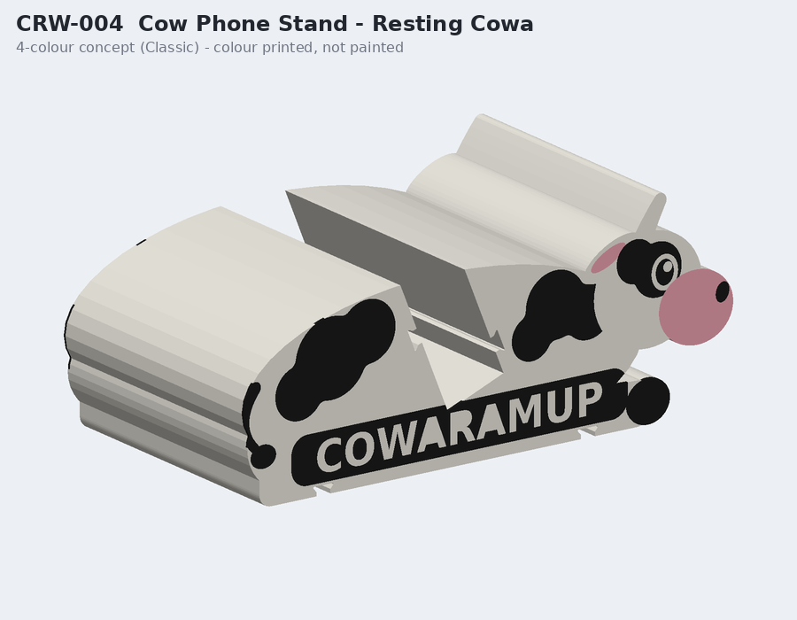
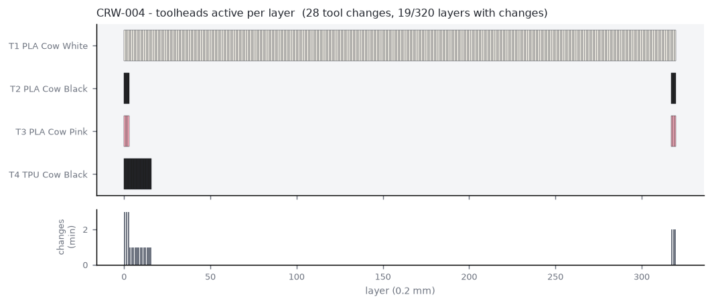

# CRW-004 - Cow Phone Stand - Resting Cowa

*C - Multi-material functional - STANDARD - tier SMALL_GIFT*

Resting-cow profile phone stand (portrait + landscape, case-compatible up to ~12.6 mm) with four slide-in TPU pads (two contact pads, two non-slip feet) and 4-colour flank artwork on both sides.

## Manufacturing

- **Strategy:** D - inserted TPU components (+A sandwich inlay artwork)
- **Print orientation:** On its side (profile on the bed); TPU pads face-down beside it.
- **Plate footprint:** 179.28 x 63.0 x 64.0 mm
- **Supports:** none (all overhangs <= 45 deg, bridges short)
- **Hardware:** none
- **Recommended batch:** 3 per plate

## Toolhead utilisation (per unit, estimate)

| Tool | Material / colour | Used for | Grams |
|---|---|---|---|
| tool_1 | PLA Cow White | structural stand body, knocked-out lettering, horn, highlights | 79.01 |
| tool_2 | PLA Cow Black | patches, COWARAMUP band, eye, nostril, hoof, tail | 2.33 |
| tool_3 | PLA Cow Pink | muzzle, inner ear | 0.37 |
| tool_4 | TPU Cow Black | TPU contact pads + non-slip feet (functional) | 4.49 |

- Purge (single unit): **1.68 g** from **28** tool changes on 19/320 layers
- Total material (single unit incl. purge): **87.88 g**
- Estimated print time (single unit): **235.2 min** (extrusion 207.8, tool changes 3.7, layers 8.0, heat-up 5.0)

## Economics (NORMAL scenario, recommended batch) - estimate only

- Unit cost **$5.94**; suggested retail **$15-20** (price band / cost floor - not a demand forecast)

## Self-critique

- **exploits 4 tools:** Yes - 3 decorative colours + a functional flexible material in one plate.
- **multi material purpose:** TPU = grip + phone protection + non-slip feet. PLA = stiffness.
- **tool change reduction:** TPU pads are only 9 layers tall and share layers with the bottom inlay; the 300+ core layers are single-tool.
- **single colour alternative:** Possible, but would need glued rubber feet and painted artwork.

## Notes / known risks

- TPU pads slide in from either side; a tight fit is intended. If loose, reduce GROOVE_CLEAR or add a dab of CA at one end.
- No charging-cable channel in this prototype (profile-extruded design). Candidate for v2: a 12 mm notch in the slot floor at mid-width (requires a bridged cut).

## Files

- `3mf/prototypes/CRW-004-cow-phone-stand.3mf`
- `stl/prototypes/CRW-004-cow-phone-stand.stl`
- `stl/prototypes/CRW-004-cow-phone-stand/CRW-004-cow-phone-stand.scad`
- STEP: not generated (see documentation/assumptions.md)

Previews: `previews/CRW-004-cow-phone-stand/` (single-colour, four-colour, multi-material, dimensions, print orientation, variants)
