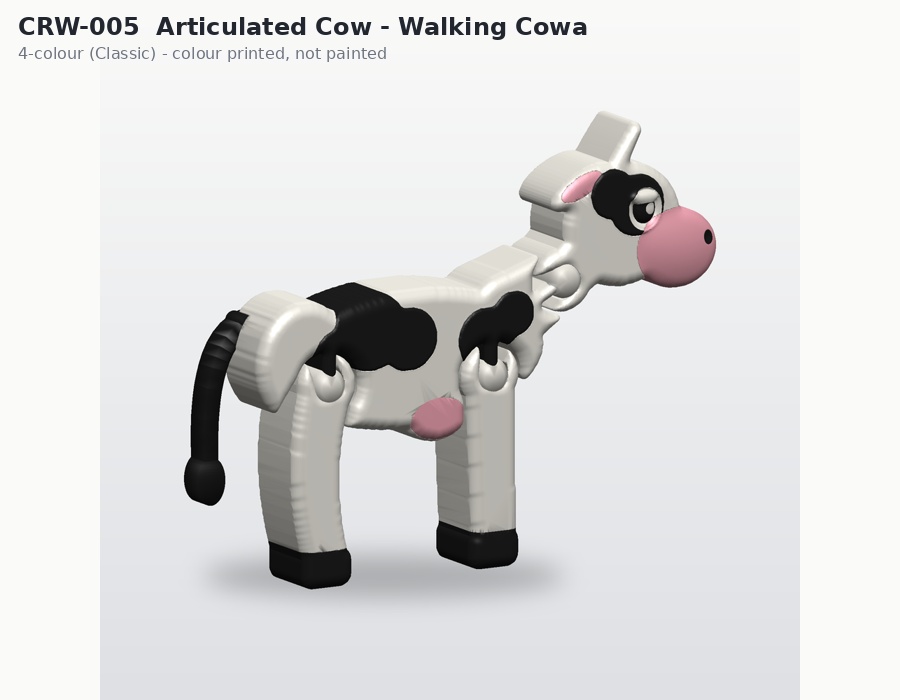
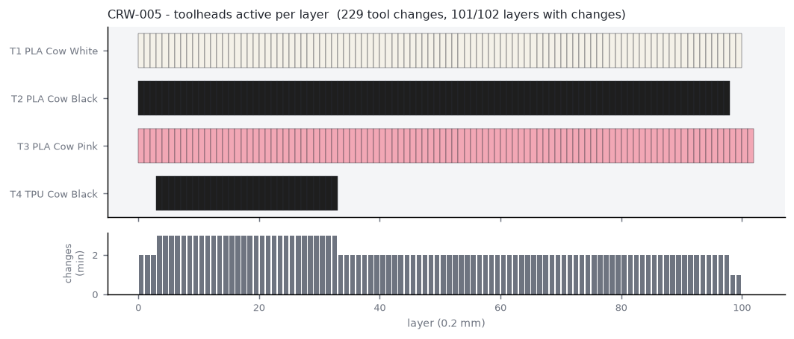

# CRW-005 - Articulated Cow - Walking Cowa

*F - Kids / interactive (flagship) - STANDARD - tier PREMIUM*

Print-in-place articulated mascot: nodding head, posable front and rear legs with built-in stops (stands unaided), flexible TPU tail, 4-colour skins on both flanks. No glue, no assembly.

## Manufacturing

- **Strategy:** A - one multi-material print-in-place model (+ fused TPU tail)
- **Print orientation:** Lying on its (left) side, joints vertical. No supports. Break joints free gently after printing.
- **Plate footprint:** 127.63 x 97.76 x 20.32 mm
- **Supports:** required
- **Hardware:** none
- **Recommended batch:** 2 per plate

## Toolhead utilisation (per unit, estimate)

| Tool | Material / colour | Used for | Grams |
|---|---|---|---|
| tool_1 | PLA Cow White | all structural members, joint posts/rings, eye highlights | 33.65 |
| tool_2 | PLA Cow Black | patches, eye, nostril, hooves | 5.94 |
| tool_3 | PLA Cow Pink | muzzle, inner ear, udder | 3.15 |
| tool_4 | TPU Cow Black | flexible tail (TPU) | 1.34 |

- Purge (single unit): **13.74 g** from **229** tool changes on 101/102 layers
- Total material (single unit incl. purge): **57.82 g**
- Estimated print time (single unit): **143.9 min** (extrusion 103.1, tool changes 30.5, layers 2.5, heat-up 5.0)

## Economics (NORMAL scenario, recommended batch) - estimate only

- Unit cost **$6.99**; suggested retail **$20-50** (price band / cost floor - not a demand forecast)

## Self-critique

- **exploits 4 tools:** Yes - colour skins + a flexible tail in a single print-in-place job; the single-colour equivalent needs painting and a separate rubber tail.
- **reliability:** Every member starts on the bed; all overhangs <= 45 deg; stops are geometric.
- **tool change reduction:** Colour only in 6 skin layers + TPU in the bottom 30 layers.
- **suitcase durability:** No part thinner than 3.6 mm except the TPU tail, which bends.

## Notes / known risks

- Joint friction depends on real clearance: 0.5 mm radial (0.35 mm normal on the 45-degree faces) is a starting point - print the joint test coupon first.
- Legs appear as one leg per pair in side view (the pair is one 18 mm member).

## Files

- `3mf/prototypes/CRW-005-articulated-cow.3mf`
- `3mf/prototypes/variants/CRW-005-articulated-cow--jersey.3mf`
- `stl/prototypes/CRW-005-articulated-cow.stl`
- `stl/prototypes/CRW-005-articulated-cow/CRW-005-articulated-cow.scad`
- STEP: not generated (see documentation/assumptions.md)

Previews: `previews/CRW-005-articulated-cow/` (single-colour, four-colour, multi-material, dimensions, print orientation, variants)
