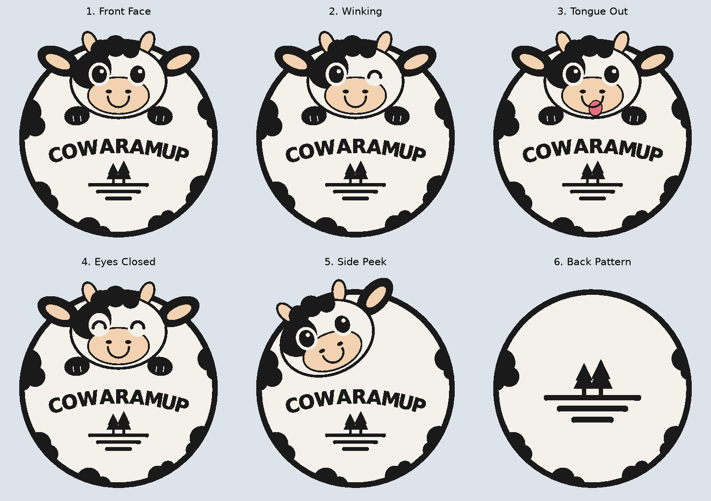

# COWARAMUP cow coaster set

Six multi-colour cup coasters plus a holder, generated with CadQuery by
[`generate.py`](generate.py) from the "Coaster Designs (Stackable)" concept sheet.



## What's in the set

| # | Design | Colours | Size (mm) |
|---|---|---|---|
| 1 | Front Face | white, black, cream | 98 × 102 × 2.0 |
| 2 | Winking | white, black, cream | 98 × 102 × 2.0 |
| 3 | Tongue Out | white, black, cream, pink | 98 × 102 × 2.0 |
| 4 | Eyes Closed | white, black, cream | 98 × 102 × 2.0 |
| 5 | Side Peek | white, black, cream | 98 × 104 × 2.0 |
| 6 | Back Pattern | white, black | 98 × 98 × 2.0 |
| – | Holder (U-cradle) | black | 110 × 37 × 65 |

Six coasters stacked are 12 mm tall (6 × 2 mm).

## How each coaster is built

Print face-up. With 0.2 mm layers, every colour change is in the top 5 layers:

| z (mm) | Layer |
|---|---|
| 0.0 – 1.0 | White base across the whole outline |
| 1.0 – 1.6 | Artwork set flush into the surface: black spots, text, logo and outlines; cream muzzle, ears and horns; pink tongue |
| 1.6 – 2.0 | Raised black lip around the rim. It catches drips and gives stacked coasters something to rest on |

- The top is flat inside the lip, so a cup sits level.
- Edges are rounded by the ring and ellipse geometry; no sharp corners.
- The holder takes six coasters standing on edge, facing forward. The front and back walls are cut down in a curve so the faces show. There is a thumb slot in the floor for pushing the stack up.

## Files (`output/`)

- `coaster_N_<design>.3mf`: one object per colour, with display colours set. Open it in FlashPrint, Orca, Bambu Studio or PrusaSlicer and assign a filament to each part.
- `coaster_N_<design>_<colour>.stl`: one STL per colour, all sharing the same origin, for slicers that build a multi-colour model from separate files. These are not committed; regenerate them (see below).
- `holder.3mf` / `holder.stl`: the holder, printed as one colour.
- `*.png`: top-down previews.

## Print settings (PLA or PETG)

- 0.2 mm layers (0.1–0.12 mm gives crisper text). 100 % infill on the coasters, since they are only 2 mm thick.
- Coasters: no supports needed, and no brim needed on a textured PEI plate.
- Holder: print upright, no supports needed. 3 walls and 15–20 % infill.
- Optional: stick felt or cork dots on the underside so the coasters don't slide.

## Regenerate / customise

```bash
# from the repo root (the first run installs CadQuery into apps/engine/.venv)
uv run --project apps/engine python examples/cowaramup-coaster/generate.py
uv run --project apps/engine python examples/cowaramup-coaster/generate.py --only tongue-out
uv run --project apps/engine python examples/cowaramup-coaster/generate.py --only holder
```

- Thickness, rim and colours: `BASE`, `INLAY`, `LIP`, `R`, `RIM_W` and `COLORS` at the top of `generate.py`.
- Lettering font: `--font /path/to/font.ttf`. The default is DejaVu Sans Bold. A rounded bold font such as Fredoka or Nunito Black is closer to the concept art.
- Holder: `build_holder(width, height, count)`.

> **Note on the holder depth.** The concept sheet gives the holder's side-view dimension as 100 mm. Six 2 mm coasters only need a slot about 17 mm deep, so the holder is 37 mm deep instead. That is enough for the coasters to stand steadily without a lot of empty space. To make it deeper, increase the `+ 14.0` in `build_holder`.
